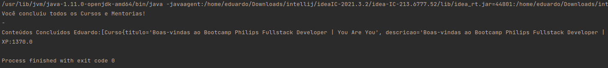

# Desafio de Projeto: Abstraindo um Bootcamp Usando Orientação a Objetos em Java

Desafio de Projeto do **Bootcamp Philips Fullstack Developer**, promovido pela [Digital Innovation One](https://www.dio.me).

## Descrição do Desafio

Desmistifique a Programação Orientada a Objetos (POO) com Java e pratique esse conceito fundamental nesse desafio. Para isso, os pilares da OO são devidamente formalizados: Abstração, Encapsulamento, Herança e Polimorfismo. Neste desafio, você poderá desenvolver sua capacidade de abstração com um problema real e implementar as evoluções que achar interessantes.

## Ajustes feitos:

* Cadastro de todos os cursos constantes no Bootcamp;
* Cadastro de todas as mentorias;
* Progressão de todos os cursos.

### Print da Tela do Programa em Execução

