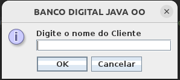
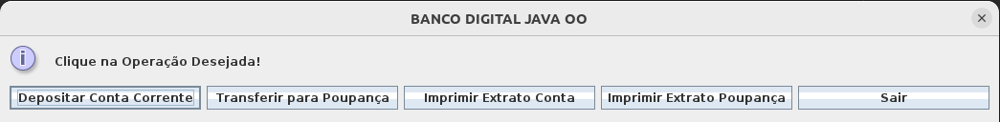
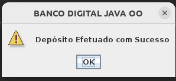
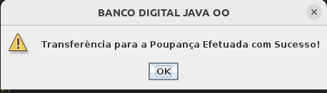
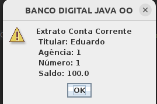
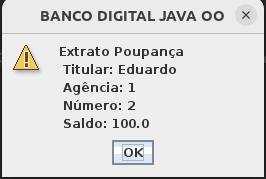
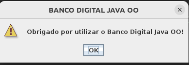

# Desafio de Projeto: Criando um Banco Digital com Java e Orientação a Objetos

Desafio de Projeto do **Bootcamp Philips Fullstack Developer**, promovido pela [Digital Innovation One](https://www.dio.me).

## Domínio / Problema

Considerado nosso conhecimento no domínio bancário, iremos abstrair uma solução Orientada a Objetos em Java.
Para isso, vamos interpretar o seguinte cenário:

> "Um banco oferece aos seus clientes dois tipos de contas (corrente e poupança),
as quais possuem as funcionalidades de depósito, saque e transferência (entre contas
da própria instituição)."

## Ajustes feitos:

* Adoção do padrão MVC.
* Adoção do Pacote Javax Swing.
* Inclusão de menu principal para navegação entre as operações bancárias.

### Prints das Telas do Programa em Execução

