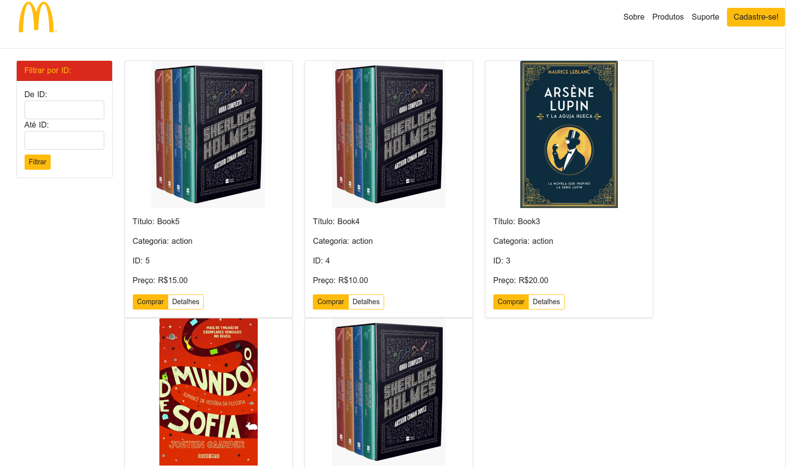

# McDonald's Bookstore

## Desafio de Projeto: Como criar um front-end de um e-commerce utilizando Angular

## Alterações Feitas:
		      
* Deploy do backend feito em C# pela Instrutora, no Azure: [https://apibookstore20220408185052.azurewebsites.net/api/bookstore]
*  Alteração do nome para MCDonald's Bookstore.
* Ajuste de rota padrão.
*  Adoção de esquema de cores e alterações de CSS necessárias para funcionamento.

# Print da Tela - McDonald's Bookstore

## Development server

This project was generated with [Angular CLI](https://github.com/angular/angular-cli) version 12.2.2.

Run `ng serve` for a dev server. Navigate to `http://localhost:4200/`. The app will automatically reload if you change any of the source files.

## Code scaffolding

Run `ng generate component component-name` to generate a new component. You can also use `ng generate directive|pipe|service|class|guard|interface|enum|module`.

## Build

Run `ng build` to build the project. The build artifacts will be stored in the `dist/` directory.

## Running unit tests

Run `ng test` to execute the unit tests via [Karma](https://karma-runner.github.io).

## Running end-to-end tests

Run `ng e2e` to execute the end-to-end tests via a platform of your choice. To use this command, you need to first add a package that implements end-to-end testing capabilities.

## Further help

To get more help on the Angular CLI use `ng help` or go check out the [Angular CLI Overview and Command Reference](https://angular.io/cli) page.
